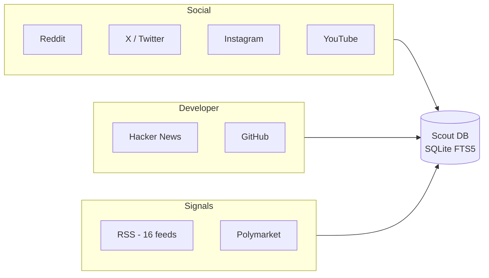
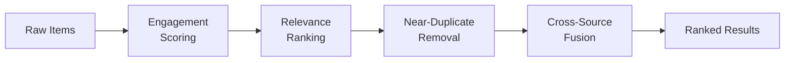
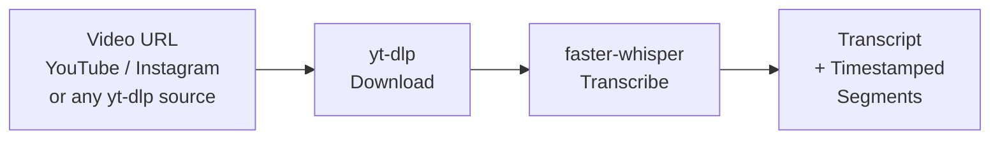

# @scout-scraper/core

Community intelligence for your AI assistant. Scout scrapes Reddit, Hacker News, GitHub, YouTube, X, Instagram, Polymarket, and 16+ RSS feeds - ranks results across all of them, and exposes everything as MCP tools your AI can call directly.

**Zero cost for the core setup. Works with any MCP-compatible AI client.**

---

## Why Scout

AI assistants can search the web, but they cannot:

- Monitor specific communities and feeds you care about
- Build a local, searchable database of everything it finds over time
- Rank results across 8 sources simultaneously by cross-source consensus
- Track your own social profiles across platforms
- Pull prediction market signals from Polymarket
- Transcribe any YouTube or Instagram video into structured segments

Scout is not a web search replacement. It is a curated intelligence layer - specific sources, persistent local storage, and ranked results so your AI gets signal, not noise.

---

## Works With Any MCP Client

Scout implements the open [Model Context Protocol](https://modelcontextprotocol.io). The same config works across:

| Client | Config location |
|--------|----------------|
| Claude Desktop | `~/Library/Application Support/Claude/claude_desktop_config.json` |
| Claude Code | `claude mcp add scout -- npx scout-scraper` |
| Cursor | `.cursor/mcp.json` in your project root |
| Windsurf | `~/.codeium/windsurf/mcp_config.json` |
| Cline, Continue, Zed | See your client's MCP documentation |

The config block is the same everywhere:

```json
{
  "mcpServers": {
    "scout": {
      "command": "npx",
      "args": ["scout-scraper"]
    }
  }
}
```

Restart your client after adding it.

---

## Quick Start

**Step 1 - Add Scout to your MCP client** (config block above)

**Step 2 - One prerequisite for GitHub** (free, one-time):

```bash
brew install gh && gh auth login
```

That is it for the core setup. Reddit, Hacker News, Polymarket, and all 16 RSS feeds work with no auth at all.

---

## Runtime Modes

Scout ships as one package with three supported entry points:

| Mode | Command | Use case |
|------|---------|----------|
| NPM library | `import { ... } from "@scout-scraper/core"` | Call Scout from another Node.js application. |
| Stdio MCP server | `npx scout-scraper` | Attach Scout directly to an MCP-compatible assistant. |
| HTTP server | `scout-scraper serve --host 127.0.0.1 --port 8890` | Run Scout as a long-lived service under PM2, Docker, or another process manager. |

The HTTP server exposes a stateless `/mcp` endpoint plus deterministic JSON endpoints for generic source operations such as Apify pricing, actor runs, run recovery, and run listing. Set `SCOUT_AUTH_TOKEN` to require bearer auth for `/mcp` and `/v1/*` routes.

---

## What You Can Ask

Once Scout is connected, your AI can use it naturally:

- "What is trending in AI this week across Reddit, HN, and GitHub?"
- "Find what developers are saying about Next.js App Router performance issues"
- "Pull the latest Polymarket markets on AI regulation"
- "Transcribe this YouTube video and summarise the key points"
- "What are the top posts on r/SideProject this week?"
- "Show me my Reddit profile stats"
- "Search my saved Scout history for anything about LangChain"

---

## Sources

Scout covers 9 sources. All are implemented and active when configured.

| Source | Auth needed | What it covers |
|--------|-------------|----------------|
| Reddit | None | 10 default subreddits: r/MachineLearning, r/artificial, r/LocalLLaMA, r/webdev, r/SaaS, r/SideProject, r/freelance, r/entrepreneur, r/OpenAI, r/nextjs |
| Hacker News | None | Search + front page + Who's Hiring feed |
| Polymarket | None | Prediction markets - use as trend signal for emerging topics |
| RSS Feeds (16) | None | TechCrunch, MIT Tech Review, VentureBeat, TLDR, Simon Willison, Hugging Face Blog, Latent Space, Ahead of AI, ArXiv cs.AI, ArXiv cs.LG, HN Front Page, HN Who's Hiring, GitHub Trending, Product Hunt, SaaStr, Indie Hackers |
| GitHub | `gh auth login` | Repo search and trending - requires GitHub CLI (free) |
| YouTube | `brew install yt-dlp` | Search + curated channel list (Matt Wolfe, Fireship, Karpathy, Lex Fridman, Theo, ThePrimeagen + more) |
| X / Twitter | Burner account cookies | Search via session auth |
| Instagram | Burner account credentials | Hashtag and profile search via Python bridge |
| Web (SearXNG / Brave) | `SCOUT_SEARXNG_URL` or `SCOUT_BRAVE_API_KEY` | General web search - blog posts, docs, articles. Optional - skipped if not configured |

---

## How It Works

### Layer 1 - Source Pipeline



### Layer 2 - Intelligence Pipeline

Raw items from all sources pass through a ranking pipeline before being returned. Cross-source consensus is the key signal - a topic appearing on both HN and Reddit ranks higher than the same topic on either alone.



### Vision Pipeline



Requires: `brew install yt-dlp ffmpeg` and `pip install faster-whisper`

---

## Available Tools

| Tool | Description |
|------|-------------|
| `search_topic` | Search any topic across all 8 sources simultaneously. Returns ranked, deduplicated results. |
| `get_trending` | Trending content in a niche over the past N days. |
| `scrape_platform` | Targeted scrape of one platform - profile, hashtag, channel, or keyword. |
| `raw_scrape` | Same as scrape_platform but returns unranked, unprocessed results. |
| `score_and_rank` | Run the intelligence layer on items you already have from any source. |
| `analyze_video` | Download and transcribe any public video. Returns full transcript + timestamped segments. |
| `scrape_own_profiles` | Sync your social stats from Reddit, YouTube, X, and Instagram. |
| `get_profile_snapshot` | Retrieve the latest stored profile snapshot for any platform. |
| `get_scout_status` | Health check - what handles are configured, when Scout last ran, item counts. |
| `scout_search` | Full-text search over everything Scout has fetched and stored locally. Instant, no network call. |
| `check_pending_threads` | Scan your Reddit inbox for open threads with unanswered replies. |
| `resolve_thread` | Mark a Reddit thread as resolved after you have replied. |

---

## Full Setup

### Core (Reddit, HN, Polymarket, RSS - no auth)

```bash
# No setup needed beyond adding Scout to your MCP client config
```

### GitHub

```bash
brew install gh && gh auth login
```

### YouTube + Video Transcription

```bash
# YouTube search and channel monitoring
brew install yt-dlp

# Video transcription (analyze_video tool)
brew install yt-dlp ffmpeg
python3 -m venv .venv && source .venv/bin/activate
pip install faster-whisper
```

### X / Twitter

1. Create a fresh X account with a throwaway email (keep your main account separate)
2. Open it in Safari
3. Open DevTools - Storage - Cookies - x.com
4. Copy the values for `auth_token` and `ct0`
5. Set environment variables:

```env
SCOUT_X_AUTH_TOKEN=your_auth_token
SCOUT_X_CT0=your_ct0_value
SCOUT_X_HANDLE=@your_handle
```

### Instagram

1. Create an Instagram account with a temp email - age it for 2+ weeks before use (follow some accounts, post once)
2. Set environment variables:

```env
SCOUT_IG_USERNAME=your_username
SCOUT_IG_PASSWORD=your_password
SCOUT_IG_HANDLE=@your_handle
```

3. Install the Python dependency:

```bash
pip3 install instagrapi
```

---

## Environment Variables

All variables are optional. The core setup needs none.

| Variable | What it enables |
|----------|----------------|
| `SCOUT_REDDIT_HANDLE` | Profile sync for your Reddit account |
| `SCOUT_YOUTUBE_HANDLE` | Profile sync for your YouTube channel |
| `SCOUT_X_HANDLE` | Profile sync and X search |
| `SCOUT_X_AUTH_TOKEN` | X cookie auth (pair with CT0) |
| `SCOUT_X_CT0` | X cookie auth (pair with AUTH_TOKEN) |
| `SCOUT_IG_HANDLE` | Instagram handle for profile sync |
| `SCOUT_IG_USERNAME` | Instagram login (burner account) |
| `SCOUT_IG_PASSWORD` | Instagram login (burner account) |
| `SCOUT_WHISPER_MODEL` | Transcription quality: `tiny` / `base` / `small`. Default: `tiny` |
| `SCOUT_TEMP_DIR` | Temp directory for video downloads. Default: `/tmp/scout-scraper` |
| `SCOUT_SEARXNG_URL` | SearXNG instance URL e.g. `http://localhost:8080`. Enables web search (self-hosted) |
| `SCOUT_BRAVE_API_KEY` | Brave Search API key. Enables web search (managed). SearXNG takes priority if both set |
| `SCOUT_VENV_PYTHON` | Path to Python executable if using a custom venv |

---

## Data Storage

Scout stores everything locally:

```
~/.local/share/scout-scraper/scout.db
```

- SQLite with WAL mode (safe for concurrent access)
- FTS5 full-text search on all stored items
- SHA-256 deduplication so the same item is never stored twice
- Nothing leaves your machine beyond the API calls to each source

---

## Web Search - Optional

Scout supports general web search as a 9th source - blog posts, documentation, review articles, and long-tail content that community feeds do not cover. Set either variable to enable it:

**Option A - SearXNG** (self-hosted, zero cost, fully private)

```env
SCOUT_SEARXNG_URL=http://localhost:8080
```

Run SearXNG in Docker locally. Aggregates Google, Bing, DuckDuckGo, and more with no external API calls.

```bash
docker run -d -p 8080:8080 searxng/searxng
```

**Option B - Brave Search API** (managed, just an API key)

```env
SCOUT_BRAVE_API_KEY=your_key_here
```

~$3/month for 2,000 queries. No Docker required. [api.search.brave.com](https://api.search.brave.com)

If both variables are set, SearXNG is used (local takes priority). If neither is set, the `web` source is silently skipped - no errors, no impact on other sources.

---

## Contributing

MIT licensed. Good places to start:

- **Add an RSS feed**: Add an entry to `RSS_FEEDS` in `src/config.ts` - one line, no other changes needed
- **Add a platform scraper**: Follow the pattern in `src/scrapers/` - each file exports `search{Platform}` and optionally `scrape{Platform}Profile`
- **Add a new MCP tool**: Register in `src/tools.ts` using the MCP SDK `mcpServer.tool()` pattern
- **Tune ranking**: Source quality weights are in `src/config.ts` under `SOURCE_QUALITY`

Open an issue before starting a large feature so we can align first.

---

## License

MIT - [@scout-scraper/core](https://github.com/scout-scraper/core)
